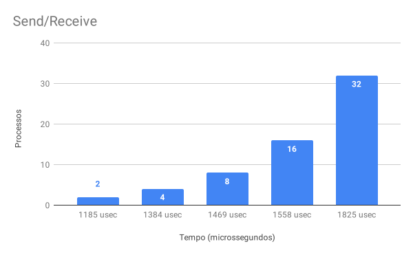
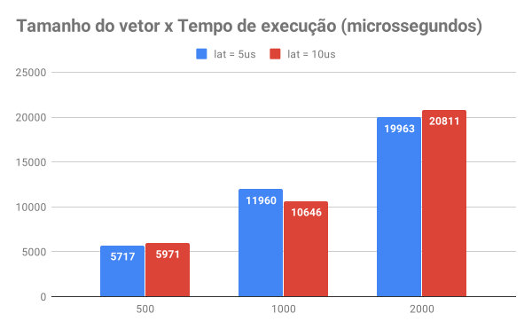
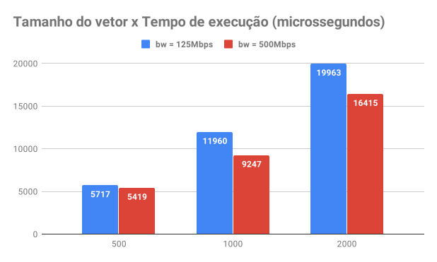

# T7: Avaliação de desempenho de programas MPI

### ELC139-2019a - Programação Paralela

**Nome:** Eduardo Rafael Hirt  
**Matrícula:** 201411329

# Parte 1

- Implementação com send/receive: [sr_bcast.c](sr_meu_bcast.c).

- Implementação com broadcast: [parte_bcast.c](sr_bcast.c)

Foi utilizada uma variação de **2 a 32 processos** e uma velocidade de execução de **45 GFlops**. Com isso, foram obtidos os resultados abaixo:

 

# Parte 2

- Programa: [avg.c](avg.c)

Aqui foram utilizados **45 GFlops** como velocidade de execução e **3 tamanhos diferentes de vetores** em cada execução (500, 1000 e 2000).

Variando a propriedade **lat** do arquivo [cluster_crossbar.xml](cluster_crossbar.xml) entre 5us e 10us os seguintes resultados foram obtidos:

Agora, variando a propriedade **dw** do mesmo arquivo entre 125Mbps e 500Mbps, temos:

